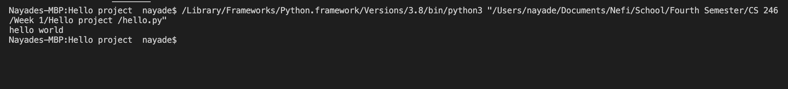

# hello-world
Repository for CS 246 first program

## Overview 
This is a program writen in python </b> 
It prints "Hello World" to the console when the program us run 

[Software Demo Video](http://youtube.link.goes.here)
 

## Development Environment 
This program used Python </b>
Please go to https://www.python.org/downloads/
to install the latest version of Python

## Useful Websites
* [W3 schools](https://www.w3schools.com/python/)
